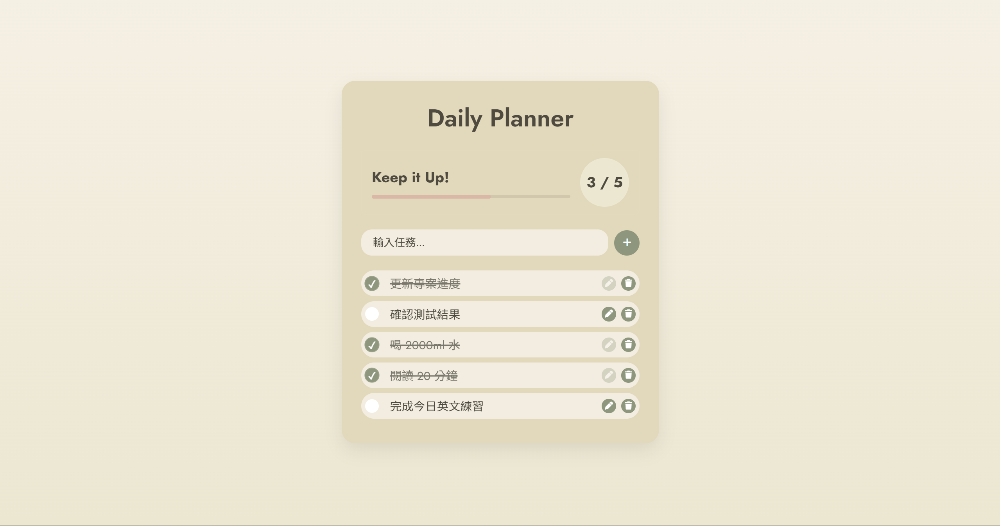

# Daily Planner

一個溫暖療癒風格的每日任務管理工具，使用 HTML、CSS 和 Vanilla JavaScript 開發。
使用者可以新增、編輯、刪除與完成任務，系統會即時計算完成進度並儲存在瀏覽器中，即使重新整理頁面也不會遺失資料。

**作品展示（點我使用）**：  
👉 [https://iiijen.github.io/Todo-List/](https://iiijen.github.io/Todo-List/)

**作品預覽**

---

## 🌱 專案特色

- 採用低飽和暖色系配色設計
- 提供直觀的每日任務管理體驗
- 支援任務完成進度追蹤
- 使用 LocalStorage 實現資料持久化
- 響應式設計，支援桌面與手機裝置

---

## ✨ 功能介紹

### 任務管理功能

- 新增任務
- 編輯任務
- 刪除任務
- 完成任務標記

### 進度追蹤

- 動態進度條
- 完成數量統計
- 即時計算完成率

### 資料儲存

- 使用 LocalStorage 保存資料
- 重新整理頁面後仍保留任務內容

### 響應式設計

- 支援桌面版
- 支援手機版瀏覽

---

## 🔧 技術細節

### 技術架構

- HTML5
- CSS3
- JavaScript (Vanilla JS)

### 資料儲存

- LocalStorage 本地端資料持久化
- JSON 格式資料存取

### 版面設計

- Flexbox 響應式排版
- CSS Variables 主題色管理
- 卡片式介面設計
- RWD 響應式網頁設計

### JavaScript 應用

- DOM 操作
- Event Listener 事件監聽
- 動態渲染任務列表
- 任務狀態管理

### UI 設計

- 低飽和暖色系配色
- 療癒風格介面設計
- Hover 互動效果
- 進度條動畫效果

---

## ✅ 學習成果

透過本專案練習：

- JavaScript DOM 操作與事件處理
- LocalStorage 資料持久化
- Flexbox 排版技巧
- 響應式網頁設計（RWD）
- UI 配色與元件設計
- 前端專案結構規劃

---

## 👩‍💻 開發者資訊

作者：艾蓁（iiijen）  
GitHub：https://github.com/iiijen
